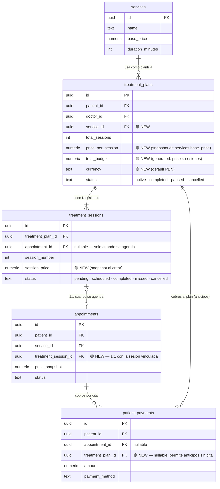
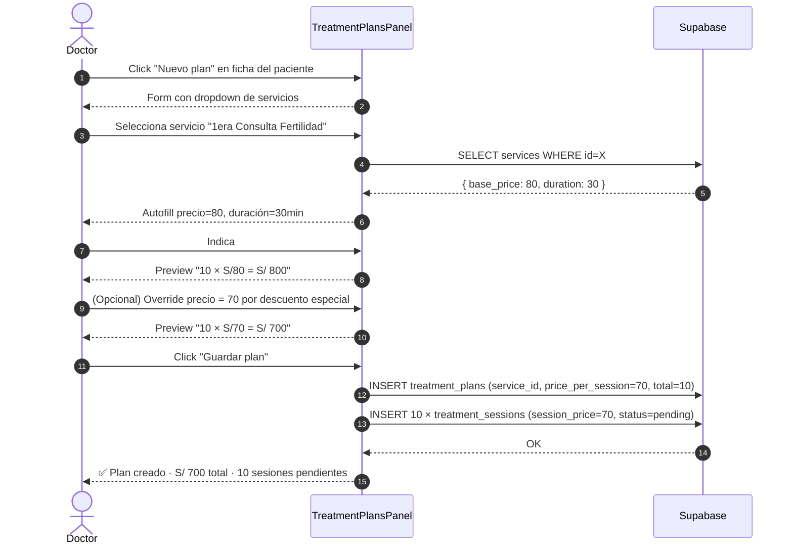
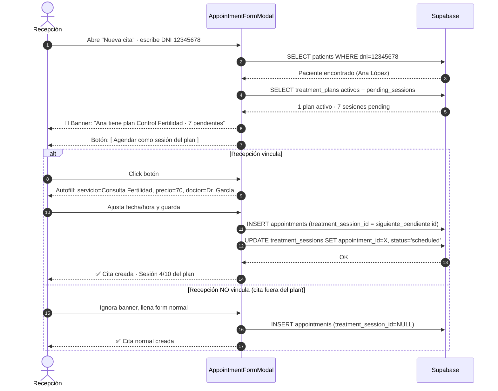
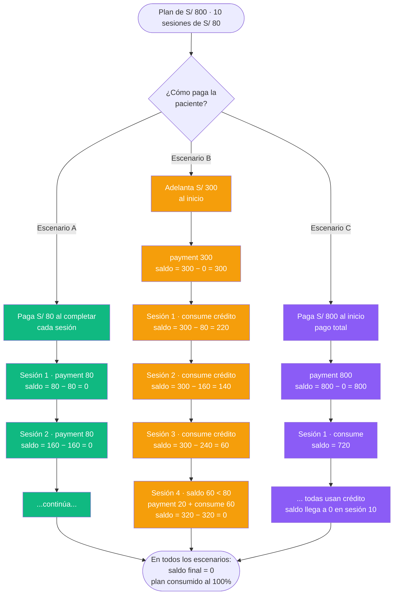
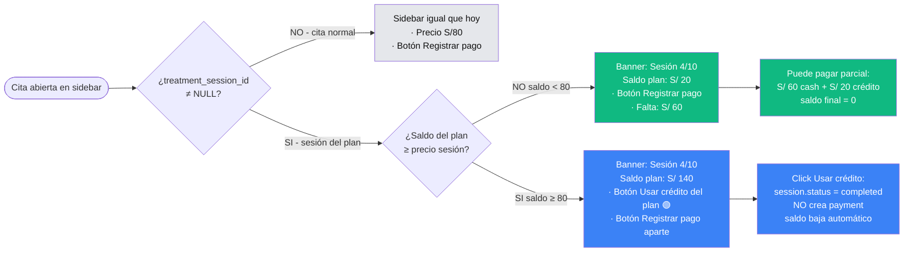
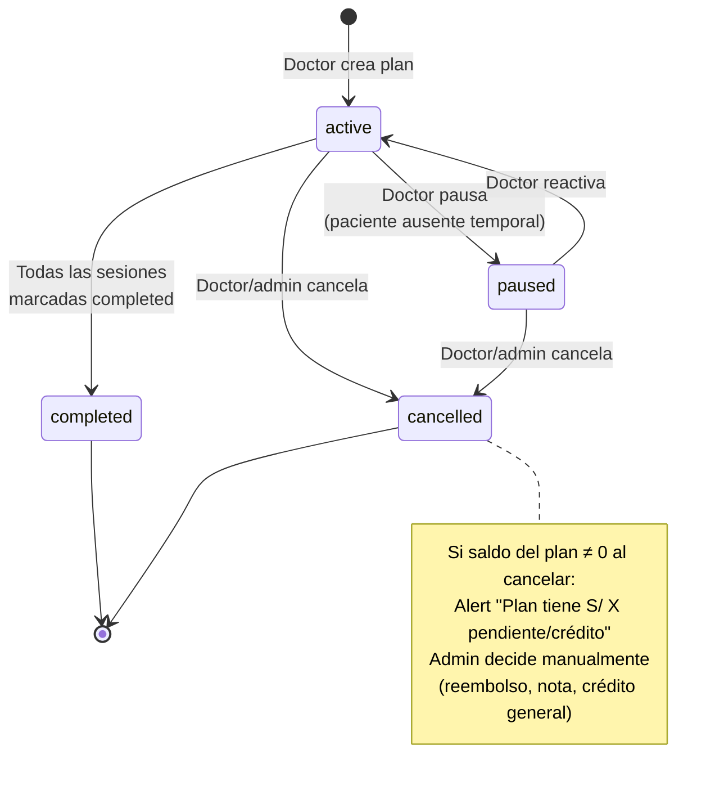
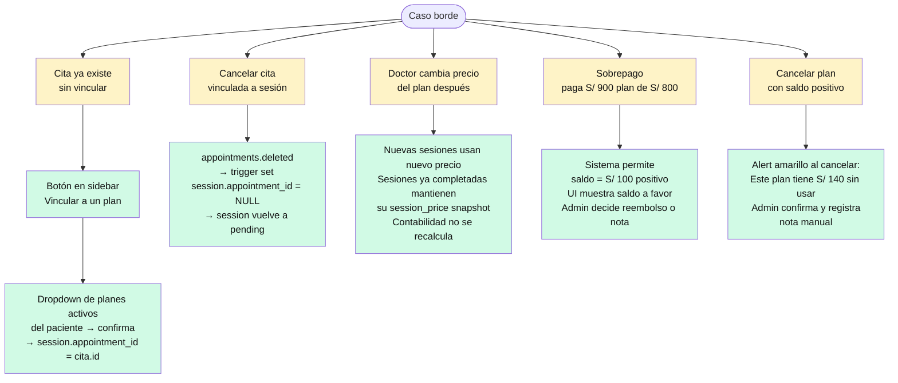
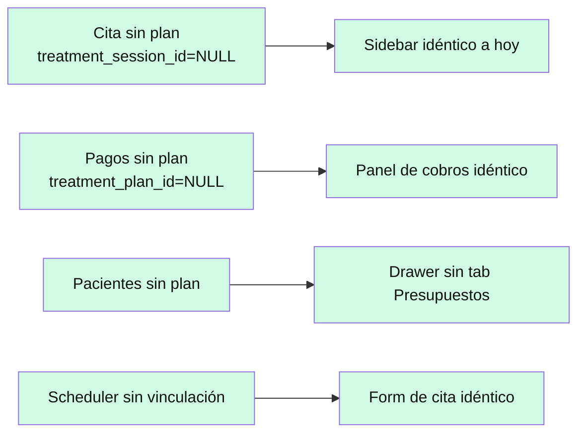

# Treatment Plans + Presupuestos — Diseño Visual

> **Feature**: Presupuestos de tratamiento ligados a servicios, vinculación cita↔sesión desde el scheduler, y contabilidad unificada por saldo del plan.
>
> **Estado**: Propuesta visual pendiente de green-light. Ningún cambio de código aún.
>
> **Para ver los diagramas**: GitHub renderiza Mermaid automáticamente. También puedes pegar cada bloque en <https://mermaid.live> o importar a Excalidraw con **Excalidraw → Menu → Generate Diagram → Mermaid**.

---

## 1. Modelo de datos — qué añadimos y cómo se conecta

Columnas nuevas en **verde**. Tablas existentes en gris.



---

## 2. Doctor crea un plan de tratamiento



**Puntos clave:**
- Precio snapshot al crear (si el admin cambia después el precio del servicio, este plan queda con el suyo).
- Las 10 sesiones se crean inmediatamente en estado `pending`, sin cita.
- Doctor puede override libre (confirmaste decisión #1).

---

## 3. Recepción crea cita → sistema detecta plan → vincula



**Puntos clave:**
- Si el paciente no tiene plan activo → banner no aparece, flujo normal.
- Si tiene varios planes → dropdown para elegir cuál vincular.
- Si ignora el banner → cita normal, no rompe nada.

---

## 4. Los 3 escenarios de pago — todos convergen en "saldo del plan"

La fórmula es **la misma** en los tres casos:

```
saldo = SUM(payments del plan) − SUM(session_price de sesiones completadas)
```



**Puntos clave:**
- **Un solo modelo contable**: no hay "estado de anticipo" separado — el saldo lo dice todo.
- Los payments se registran en la misma tabla `patient_payments`. Si es anticipo → `appointment_id = NULL`. Si es por cita → ambos llenos.
- "Consumir crédito" = marcar sesión `completed` sin crear payment nuevo. El saldo baja solo.

---

## 5. Qué ve recepción en el sidebar según el caso



---

## 6. Panel "Presupuestos" en el drawer del paciente

Nueva tab que agrega a la ficha. Estructura visual:

```
┌─────────────────────────────────────────────────────────┐
│  📋 Control de Fertilidad          [activo]             │
│  Dr. García · Consulta Fertilidad                       │
│  ─────────────────────────────────────────────────      │
│                                                          │
│  Total:      S/ 800      Pagado:     S/ 300             │
│  Consumido:  S/ 240      Saldo:      S/ 60 ✅           │
│                                                          │
│  ████████████░░░░░░░░░░░░░░░░░░░░░░░  3/10 sesiones     │
│                                                          │
│  [ Registrar pago ]   [ Ver sesiones ]                  │
│                                                          │
│  Sesiones:                                              │
│  ✓ Sesión 1  · 15 abr · completada · S/ 80             │
│  ✓ Sesión 2  · 22 abr · completada · S/ 80             │
│  ✓ Sesión 3  · 29 abr · completada · S/ 80             │
│  📅 Sesión 4  · 06 may · programada                     │
│  ⏸  Sesión 5-10         · pendiente de agendar          │
└─────────────────────────────────────────────────────────┘
```

Al hacer click en **[ Registrar pago ]**:

```
┌─────────────────────────────────────────┐
│  Registrar pago al plan          [×]   │
│                                         │
│  Monto a registrar:                    │
│  ┌───────────┐                         │
│  │ S/ 500    │  Pendiente: S/ 500      │
│  └───────────┘                         │
│                                         │
│  Presets:  [25%]  [50%]  [100% 500]    │
│                                         │
│  Método:  ○ Efectivo  ○ Yape           │
│           ○ Transferencia  ○ Tarjeta   │
│                                         │
│  Nota (opcional):                      │
│  ┌─────────────────────────────────┐   │
│  │ Anticipo total del paquete      │   │
│  └─────────────────────────────────┘   │
│                                         │
│            [ Cancelar ]  [ Guardar ]   │
└─────────────────────────────────────────┘
```

Al guardar → `INSERT patient_payments (treatment_plan_id=X, appointment_id=NULL, amount=500)` → saldo se recalcula automáticamente.

---

## 7. Qué ve el paciente en el portal

En `/portal/{slug}/mis-citas`, nueva tarjeta en el sidebar (desktop) o arriba del tab Próximas (mobile):

```
┌──────────────────────────────────────┐
│  💊 MI PLAN                           │
│  Control de Fertilidad                │
│  ──────────────────────────────────  │
│  3 de 10 sesiones completadas         │
│  ████████░░░░░░░░░░░░░░░░░░  30%      │
│                                       │
│  S/ 300 pagado · S/ 800 total         │
│  S/ 500 pendiente                     │
│                                       │
│  Próxima sesión: 06 may, 10:00 am    │
└──────────────────────────────────────┘
```

Solo muestra pagado/total (no "crédito del plan" — decisión #2 confirmada). Reduce fricción sin abrir debates de precio.

---

## 8. Ciclo de vida del plan (máquina de estados)



---

## 9. Edge cases cubiertos



---

## 10. Lo que NO cambia (compatibilidad hacia atrás)



**Ninguna migración es destructiva. Todo es aditivo con defaults `NULL`.**

---

## 11. Resumen ejecutivo de cambios

| Tipo | Cambio | Impacto |
|---|---|---|
| **Migración 099** | 5 columnas nuevas en 4 tablas | ninguna destructiva |
| **UI Doctor** | `TreatmentPlansPanel` gana form con servicio + precio editable | no rompe vistas |
| **UI Recepción** | Scheduler: banner "paciente tiene plan" al entrar DNI | opt-in |
| **UI Recepción** | Sidebar de cita: banner + botón "Usar crédito" cuando la cita es sesión del plan | aditivo |
| **UI Recepción** | Nuevo tab "Presupuestos" en drawer del paciente | nueva pestaña |
| **UI Paciente** | Card "Mi plan" en `/portal/[slug]/mis-citas` | nueva tarjeta |
| **Endpoints** | `GET /api/treatment-plans/[id]/balance` (cómputo de saldo) | nuevo |
| **Endpoints** | `POST /api/treatment-plans/[id]/payments` (anticipos) | nuevo |

Cero breaking changes. Estimación total: **2-2.5 días**.

---

## Cómo importar esto a Excalidraw si quieres editar

1. Abre <https://excalidraw.com>
2. Menu ☰ → **Generate Diagram → Mermaid**
3. Pega el bloque `mermaid` que quieras editar
4. Exporta como PNG/SVG/excalidraw
